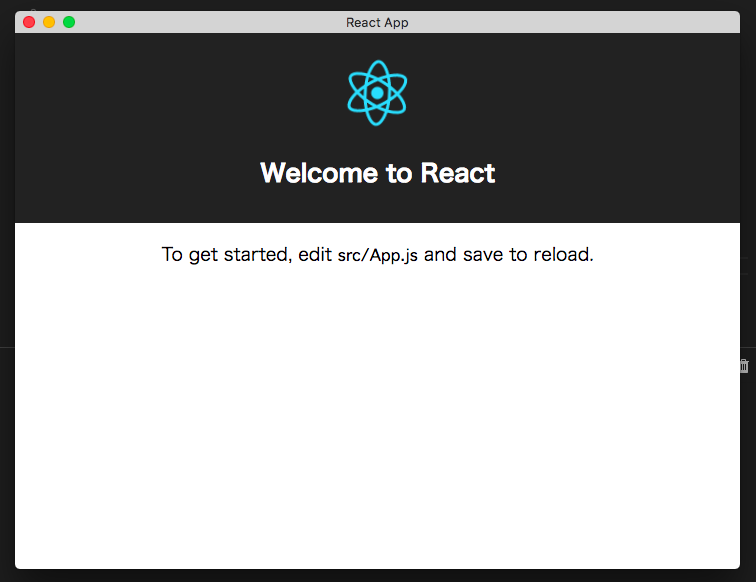

# template-class-react-eel-app



## Install

You’ll need to have Python >= 3.6, Eel, pyinstaller.

```
$ pip install eel
$ pip install pyinstaller
```

## Develop on Browser

```
$ npm run start:js
```

## Develop on GUI

```
$ npm run start
```

## Build as GUI App

```
$ npm run build
```

check `dist/react-eel-app`
